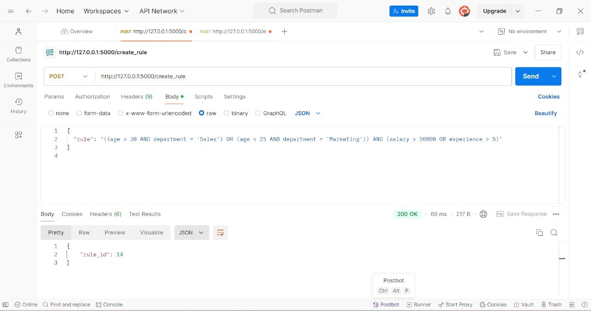
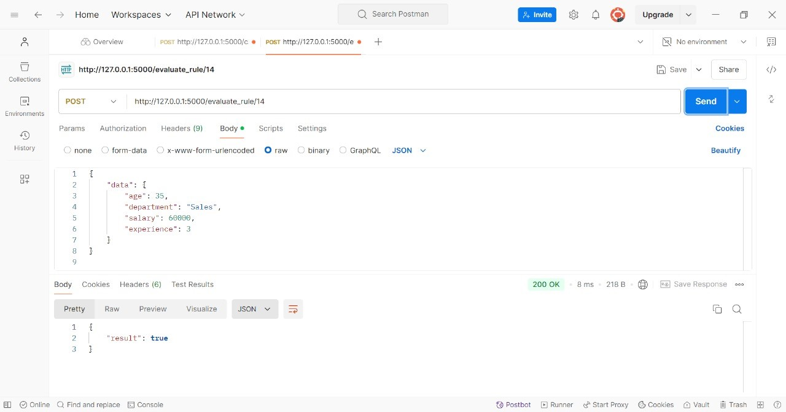
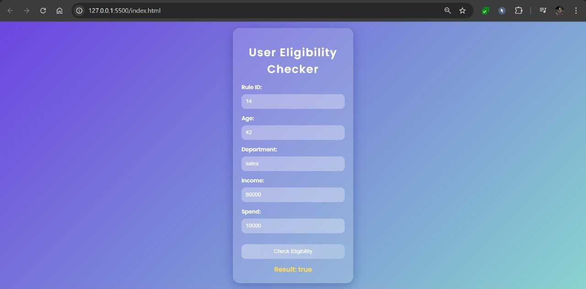
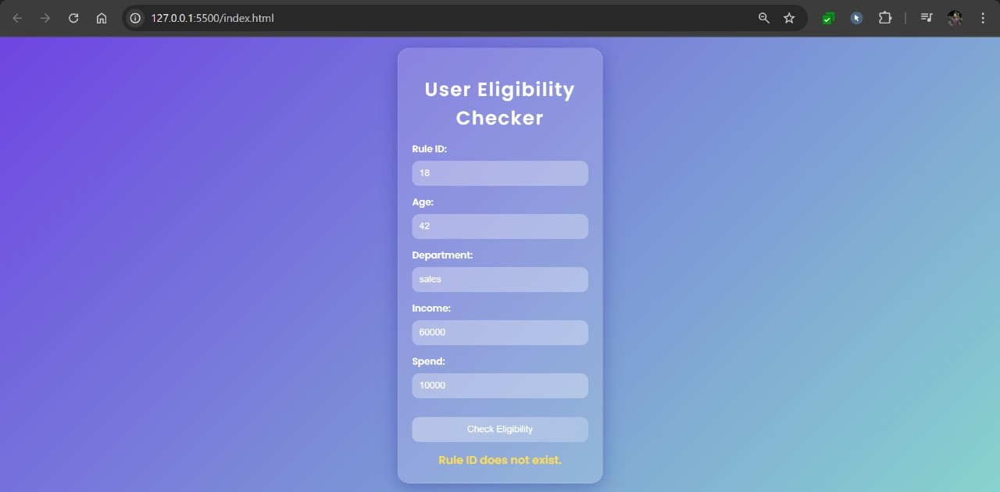
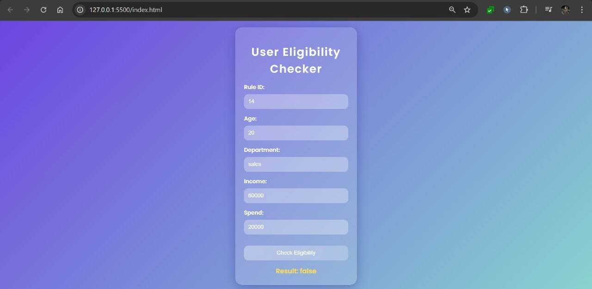

# : Rule Engine with AST

# : Features

Postman API Call: Use Postman to trigger API calls, fetch data from an external API, and receive real-time responses.

Rule Engine: A rule-based engine is integrated to validate and process API responses based on custom rules defined by the user.

Database Update: After processing the API responses, the results are updated in a database for persistent storage and future use.

User Interface: A simple interface to input rule conditions, test the rule engine, and visualize the processed data.

# : Output

